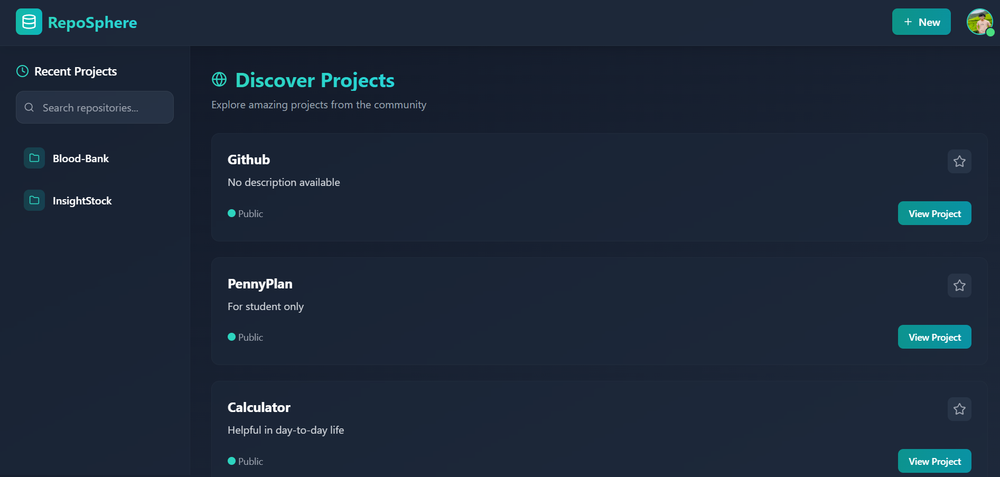
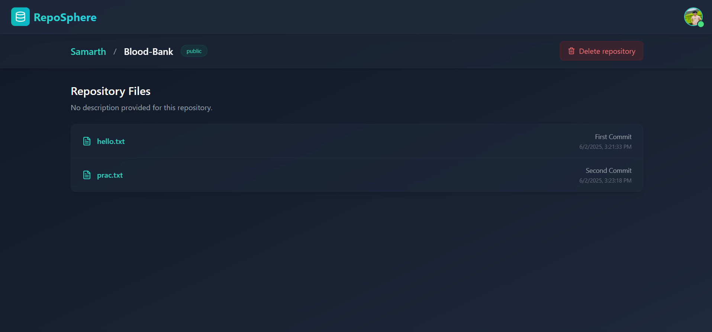
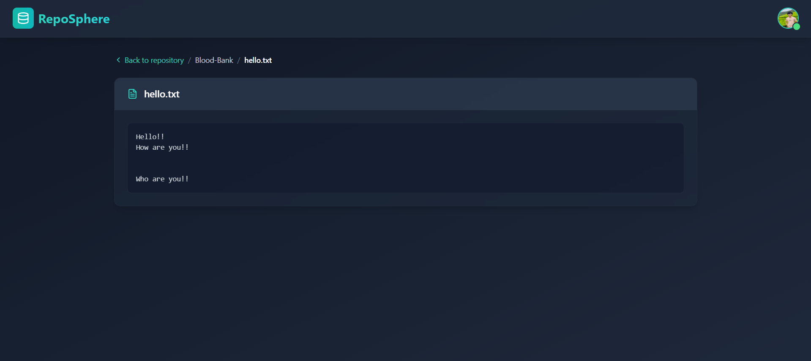
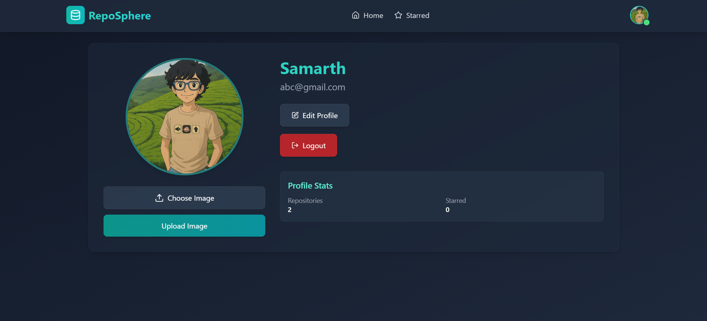
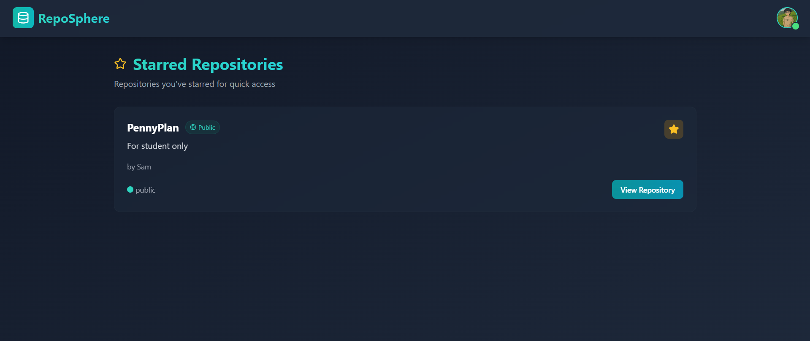

# RepoSphere

RepoSphere is a lightweight GitHub-inspired version control system that supports core version control functionalities like `init`, `add`, `commit`, `push`, and `clone`. It's built with a Node.js backend and MongoDB, and integrates with AWS S3 for file storage. The frontend is powered by React. The frontend and backend are deployed on Render.

---

## 🌐 Live Demo

* **Frontend**: [https://reposphere-1.onrender.com](https://reposphere-1.onrender.com)
* **Backend**: [https://reposphere.onrender.com](https://reposphere.onrender.com)

---

## 🚀 Features

* `init`: Initializes a new RepoSphere project by creating a `.Sphere` directory inside the backend folder.
* `add`: Stages files for commit.
* `commit`: Saves changes with a message and timestamp.
* `push`: Uploads committed changes to AWS S3.
* `clone`: Downloads a full repository and extracts the latest commit to working directory.
* JWT-based Authentication (Login/Signup)
* Secure file storage using AWS S3
* MongoDB-based repository and user management

---

## 🖼️ Screenshots

* **Home Page**
  
  

* **Repository Dashboard**

  

* **View File Content**
  
  

* **Profile Section**
  
  

* **Starred Repositories Section**
  
  

---

## 📦 Project Structure

```
RepoSphere/
├── backend/
|   ├──.Sphere/ (created after init)
│   ├── controllers/
│   ├── models/
│   ├── routes/
│   └── utils/
├── frontend/
│   ├── components/
│   ├── authContext.jsx
│   └── Router.jsx
```

---

## 🧑‍💻 How to Use Commands

### 1. `init`

```bash
node index.js init user@example.com yourpassword your-repo-name
```

* Creates `.Sphere/config.json`
* Initializes the folder structure for version control

### 2. `add <filename>`

```bash
node index.js add hello.txt
```

* Adds file(s) to `.Sphere/staging`

### 3. `commit "message"`

```bash
node index.js commit "Initial commit"
```

* Saves staged files with a commit message
* Generates a unique commit ID

### 4. `push`

```bash
node index.js push
```

* Uploads all committed files and `commit.json` to AWS S3 under your account

### 5. `clone`

```bash
node index.js clone user@example.com yourpassword your-repo-name
```

* Downloads repo from S3
* Extracts the latest commit to your working directory

---

## ⚙️ Technologies Used

* **Frontend**: React, TailwindCSS
* **Backend**: Node.js, Express.js
* **Database**: MongoDB Atlas
* **Cloud Storage**: AWS S3, Cloudinary
* **Authentication**: JWT
* **Deployment**:

  * Frontend: Render
  * Backend: Render

---

## 🛠️ Setup Locally

### Clone and Install

```bash
git clone https://github.com/samarth-146/RepoSphere.git
cd RepoSphere/backend
npm install
cd ../frontend
npm install
```

### Run Servers

```bash
# Backend
cd backend
node index.js start

# Frontend
cd frontend
npm run dev
```

---

## 📬 Contact

For queries, reach out at: `samarthganjawala202@gmail.com`
